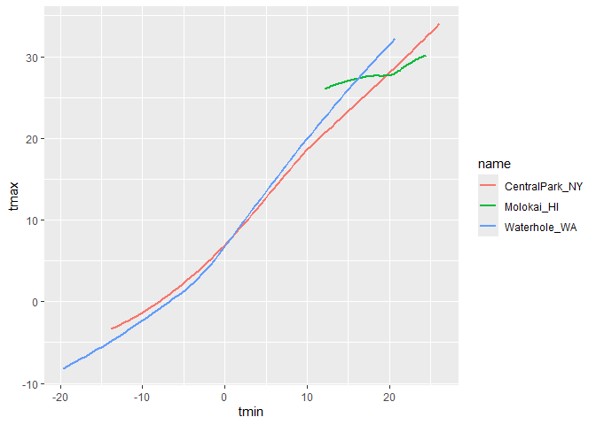
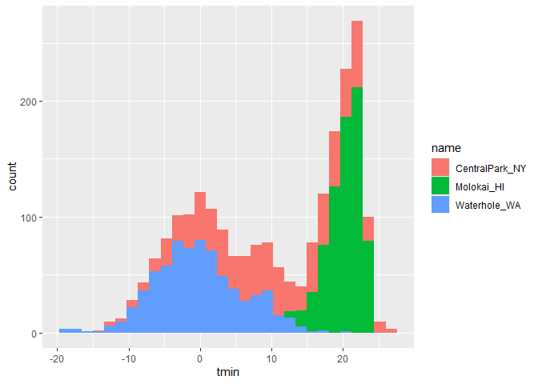
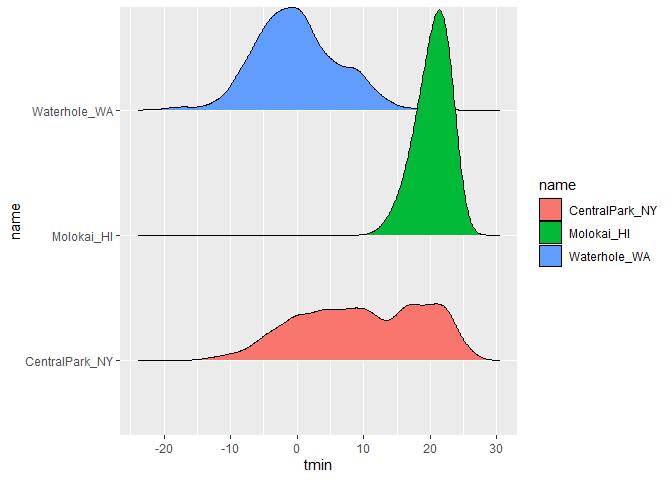
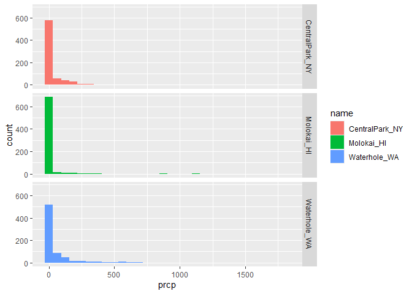

Viz 1
================

``` r
library(p8105.datasets)
data("weather_df")
```

``` r
ggp_weather_scatterplot = 
  weather_df |>
ggplot( aes(x = tmin, y = tmax)) + 
  geom_point()
ggp_weather_scatterplot
```

    ## Warning: Removed 17 rows containing missing values or values outside the scale range
    ## (`geom_point()`).

<!-- -->

``` r
weather_df |>
  filter(is.na(tmax))
```

    ## # A tibble: 17 × 6
    ##    name         id          date        prcp  tmax  tmin
    ##    <chr>        <chr>       <date>     <dbl> <dbl> <dbl>
    ##  1 Molokai_HI   USW00022534 2022-05-31    NA    NA    NA
    ##  2 Waterhole_WA USS0023B17S 2021-03-09    NA    NA    NA
    ##  3 Waterhole_WA USS0023B17S 2021-12-07    51    NA    NA
    ##  4 Waterhole_WA USS0023B17S 2021-12-31     0    NA    NA
    ##  5 Waterhole_WA USS0023B17S 2022-02-03     0    NA    NA
    ##  6 Waterhole_WA USS0023B17S 2022-08-09    NA    NA    NA
    ##  7 Waterhole_WA USS0023B17S 2022-08-10    NA    NA    NA
    ##  8 Waterhole_WA USS0023B17S 2022-08-11    NA    NA    NA
    ##  9 Waterhole_WA USS0023B17S 2022-08-12    NA    NA    NA
    ## 10 Waterhole_WA USS0023B17S 2022-08-13    NA    NA    NA
    ## 11 Waterhole_WA USS0023B17S 2022-08-14    NA    NA    NA
    ## 12 Waterhole_WA USS0023B17S 2022-08-15    NA    NA    NA
    ## 13 Waterhole_WA USS0023B17S 2022-08-16    NA    NA    NA
    ## 14 Waterhole_WA USS0023B17S 2022-08-17    NA    NA    NA
    ## 15 Waterhole_WA USS0023B17S 2022-08-18    NA    NA    NA
    ## 16 Waterhole_WA USS0023B17S 2022-08-19    NA    NA    NA
    ## 17 Waterhole_WA USS0023B17S 2022-12-31    76    NA    NA

## Fancier scatterplots

``` r
weather_df |>
  ggplot(aes(x = tmin, y = tmax, color = name)) +
  geom_point(alpha = 0.3) +
  geom_smooth( se = FALSE) # se to not show the standard error
```

    ## `geom_smooth()` using method = 'loess' and formula = 'y ~ x'

    ## Warning: Removed 17 rows containing non-finite outside the scale range
    ## (`stat_smooth()`).

    ## Warning: Removed 17 rows containing missing values or values outside the scale range
    ## (`geom_point()`).

<!-- -->

``` r
weather_df |>
  ggplot(aes(x = tmin, y = tmax)) +
  geom_point(aes(color = name), alpha = 0.3, size = 0.6) +
  geom_smooth( se = FALSE) # se to not show the standard error
```

    ## `geom_smooth()` using method = 'gam' and formula = 'y ~ s(x, bs = "cs")'

    ## Warning: Removed 17 rows containing non-finite outside the scale range
    ## (`stat_smooth()`).

    ## Warning: Removed 17 rows containing missing values or values outside the scale range
    ## (`geom_point()`).

<!-- -->

Adding the size inside the aes usign the precipitation data

``` r
weather_df |>
  ggplot(aes(x = tmin, y = tmax)) +
  geom_point(aes(color = name, size = prcp), alpha = 0.3) +
  geom_smooth( se = FALSE) # 
```

    ## `geom_smooth()` using method = 'gam' and formula = 'y ~ s(x, bs = "cs")'

    ## Warning: Removed 17 rows containing non-finite outside the scale range
    ## (`stat_smooth()`).

    ## Warning: Removed 19 rows containing missing values or values outside the scale range
    ## (`geom_point()`).

<!-- -->
Use facetting real quick

``` r
weather_df |>
  ggplot(aes(x = tmin, y = tmax)) +
  geom_point(aes(color = name), alpha = 0.3, size = 0.8) +
  geom_smooth( se = FALSE) + # se to not show the standard error
  #facet_grid(. ~ name) # name by columns
  facet_grid(name ~.) # name by row, nothing in column but three rows
```

    ## `geom_smooth()` using method = 'loess' and formula = 'y ~ x'

    ## Warning: Removed 17 rows containing non-finite outside the scale range
    ## (`stat_smooth()`).

    ## Warning: Removed 17 rows containing missing values or values outside the scale range
    ## (`geom_point()`).

<!-- -->
Let’s make it more fun

``` r
weather_df |>
  ggplot(aes(x = tmin, y = tmax, color = name)) +
  geom_point(aes(size = prcp), alpha = 0.3) +
  geom_smooth( se = FALSE) +
  facet_grid(.~ name )
```

    ## `geom_smooth()` using method = 'loess' and formula = 'y ~ x'

    ## Warning: Removed 17 rows containing non-finite outside the scale range
    ## (`stat_smooth()`).

    ## Warning: Removed 19 rows containing missing values or values outside the scale range
    ## (`geom_point()`).

<!-- -->
Add shape = name

``` r
weather_df |>
  ggplot(aes(x = tmin, y = tmax, color = name, shape = name)) +
  geom_point(aes(size = prcp), alpha = 0.3) +
  geom_smooth( se = FALSE) +
  facet_grid(.~ name )
```

    ## `geom_smooth()` using method = 'loess' and formula = 'y ~ x'

    ## Warning: Removed 17 rows containing non-finite outside the scale range
    ## (`stat_smooth()`).

    ## Warning: Removed 19 rows containing missing values or values outside the scale range
    ## (`geom_point()`).

<!-- -->
Learning assessment

``` r
weather_df |>
  filter (name == "CentralPark_NY") |>
  mutate (
    tmax_fahr = tmax * (9/5) + 32,
    tmin_fahr = tmin * (9/5) *32
  ) |>
  ggplot(aes(x = tmin_fahr, y = tmax_fahr)) +
  geom_point(alpha = 0.3) +
  geom_smooth(se = FALSE, method = "lm" )
```

    ## `geom_smooth()` using formula = 'y ~ x'

<!-- -->

## Small things

``` r
weather_df |>
  ggplot(aes(x = tmin, y = tmax, color = name, shape = name)) +
  #geom_point(alpha = 0.3) +
  geom_smooth( se = FALSE) 
```

    ## `geom_smooth()` using method = 'loess' and formula = 'y ~ x'

    ## Warning: Removed 17 rows containing non-finite outside the scale range
    ## (`stat_smooth()`).

<!-- -->

``` r
  #facet_grid(.~ name )

weather_df |>
  ggplot(aes(x = tmin, y = tmax, color = name, shape = name)) +
  
  geom_smooth( se = FALSE) +
  geom_point(alpha = 0.3) 
```

    ## `geom_smooth()` using method = 'loess' and formula = 'y ~ x'

    ## Warning: Removed 17 rows containing non-finite outside the scale range
    ## (`stat_smooth()`).

    ## Warning: Removed 17 rows containing missing values or values outside the scale range
    ## (`geom_point()`).

<!-- -->

``` r
# Using a different geom
weather_df |>
  ggplot(aes(x = tmin, y = tmax)) +
  geom_hex()
```

    ## Warning: Removed 17 rows containing non-finite outside the scale range
    ## (`stat_binhex()`).

<!-- -->

``` r
# Setting different color
 weather_df |>
  ggplot(aes(x = tmin, y = tmax)) +
  geom_point(alpha = 0.3, color = "purple")
```

    ## Warning: Removed 17 rows containing missing values or values outside the scale range
    ## (`geom_point()`).

<!-- -->

# Univariate plots

``` r
weather_df |>
   ggplot(aes( x= tmin)) +
  geom_histogram(color = "white", fill = "red")
```

    ## `stat_bin()` using `bins = 30`. Pick better value with `binwidth`.

    ## Warning: Removed 17 rows containing non-finite outside the scale range
    ## (`stat_bin()`).

<!-- -->

``` r
weather_df |>
   ggplot(aes( x= tmin, fill = name)) +
  geom_histogram()
```

    ## `stat_bin()` using `bins = 30`. Pick better value with `binwidth`.

    ## Warning: Removed 17 rows containing non-finite outside the scale range
    ## (`stat_bin()`).

<!-- -->

``` r
weather_df |>
   ggplot(aes( x= tmin, fill = name)) +
  geom_histogram() +
  facet_grid(name ~.)
```

    ## `stat_bin()` using `bins = 30`. Pick better value with `binwidth`.

    ## Warning: Removed 17 rows containing non-finite outside the scale range
    ## (`stat_bin()`).

<!-- -->
Maybe a density plot frequency/ total count

``` r
weather_df |>
   ggplot(aes( x= tmin, fill = name)) +
  geom_density(alpha = 0.2) # adding alpha to show the transparebt overlap
```

    ## Warning: Removed 17 rows containing non-finite outside the scale range
    ## (`stat_density()`).

<!-- -->

boxplot

``` r
weather_df |>
  ggplot(aes( x = name, y = tmin))+
  geom_boxplot(aes(fill = name))
```

    ## Warning: Removed 17 rows containing non-finite outside the scale range
    ## (`stat_boxplot()`).

<!-- -->
Violin plot

``` r
weather_df |>
  ggplot(aes( x = name, y = tmin, fill = name))+
  geom_violin()
```

    ## Warning: Removed 17 rows containing non-finite outside the scale range
    ## (`stat_ydensity()`).

<!-- -->
Ridge plot

``` r
weather_df |>
  ggplot ( aes(x = tmin, y = name, fill = name)) +
  geom_density_ridges()
```

    ## Picking joint bandwidth of 1.41

    ## Warning: Removed 17 rows containing non-finite outside the scale range
    ## (`stat_density_ridges()`).

<!-- -->

``` r
weather_df |>
  ggplot(aes(x = prcp, fill = name)) +
  geom_density(alpha = 0.2)
```

    ## Warning: Removed 15 rows containing non-finite outside the scale range
    ## (`stat_density()`).

<!-- -->

``` r
# try the histogram
weather_df |>
  ggplot(aes(x = prcp, fill = name)) +
  geom_histogram () +
  facet_grid( name ~ .)
```

    ## `stat_bin()` using `bins = 30`. Pick better value with `binwidth`.

    ## Warning: Removed 15 rows containing non-finite outside the scale range
    ## (`stat_bin()`).

<!-- -->

``` r
 # only looking at a range of prcp 
weather_df |>
  filter (prcp>5, prcp <1000) |>
  ggplot(aes( x = prcp, fill = name)) +
  geom_density(alpha = 0.2)
```

<!-- -->

``` r
 # try to log the data
weather_df |>
  mutate( 
    log_prcp = log(prcp)
    ) |>
  ggplot(aes(x = log_prcp, fill = name)) +
  geom_density () +
  facet_grid( name ~ .)
```

    ## Warning: Removed 1490 rows containing non-finite outside the scale range
    ## (`stat_density()`).

<!-- -->
saving plots

``` r
ggp_weather_violin = 
  weather_df |>
  ggplot(aes( x = name, y = tmin, fill = name))+
  geom_violin()
ggsave( "plot/violine_plot.pdf", ggp_weather_violin, width = 8 , height = 6)
```

    ## Warning: Removed 17 rows containing non-finite outside the scale range
    ## (`stat_ydensity()`).
