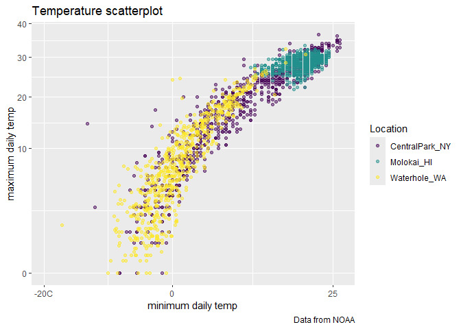

Viz 1
================

``` r
library(p8105.datasets)
data("weather_df")
```

## Scales

``` r
ggp_weather_scatterplot = 
  weather_df |>
ggplot( aes(x = tmin, y = tmax)) + 
  geom_point(aes(color = name), alpha = 0.5)+
  labs (
    x = "minimum daily temp",
    y = "maximum daily temp",
    title = "Temperature scatterplot",
    caption = "Data from NOAA",
    color = "Location"
  ) + #label the x axis
  scale_x_continuous(
    breaks = c (-20, 0,25),
    labels = c ("-20C", "0", "25")
  ) +
  scale_y_continuous(
    trans = "sqrt"
    #limits = c (10,30) # to zoom in, or can do filter command from the beginning 
  ) +
  #scale_color_hue(h = c(100,300))
  viridis::scale_color_viridis(
    discrete = TRUE
  )
ggp_weather_scatterplot
```

    ## Warning in transformation$transform(x): NaNs produced

    ## Warning in scale_y_continuous(trans = "sqrt"): sqrt transformation introduced
    ## infinite values.

    ## Warning: Removed 142 rows containing missing values or values outside the scale range
    ## (`geom_point()`).

<!-- -->
We can use the viridis color pallet
