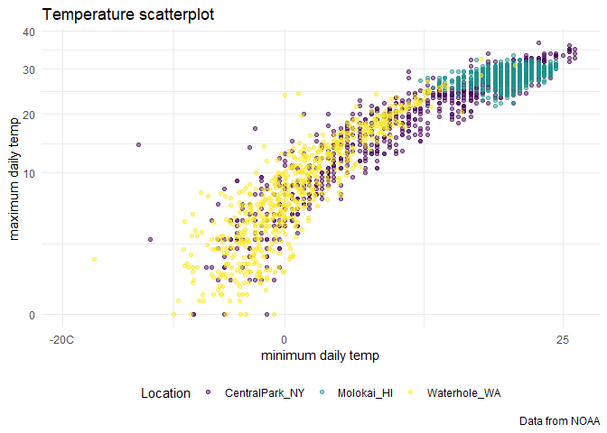
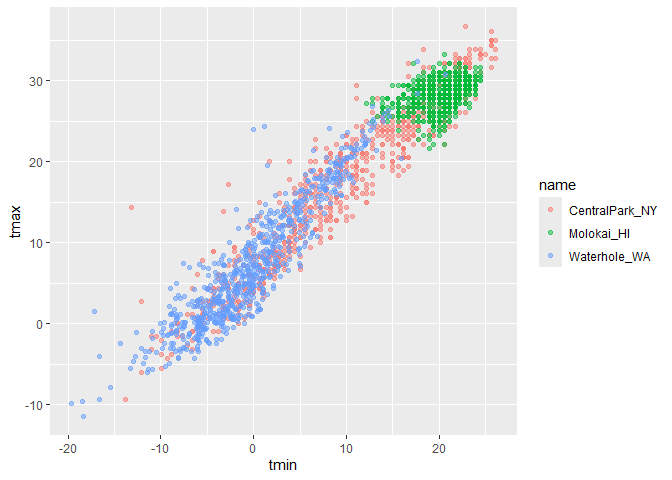
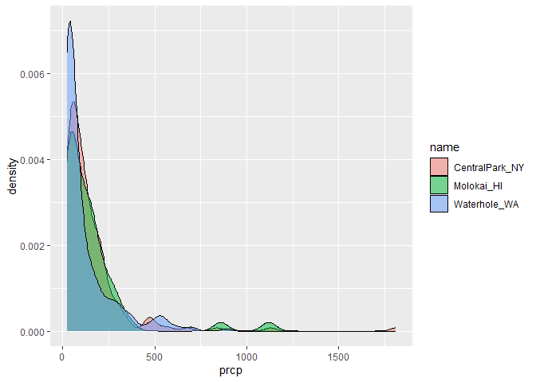
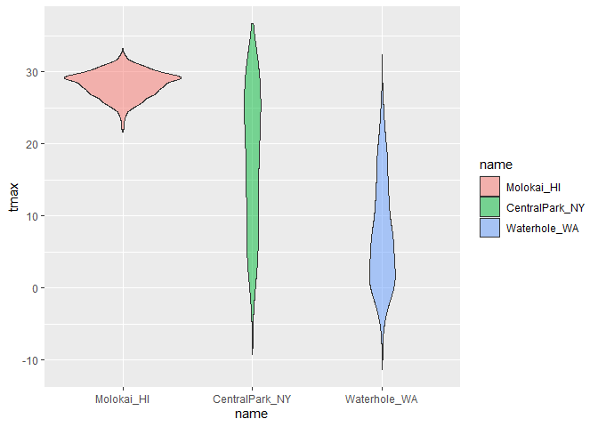
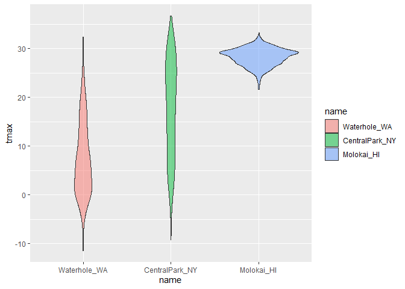
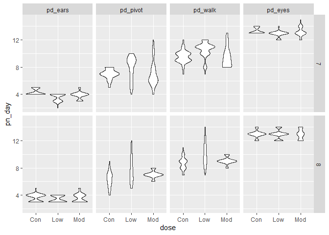

Viz 2
================

``` r
library(p8105.datasets)
data("weather_df")
```

## Scales

``` r
ggp_weather_scatterplot = 
  weather_df |>
ggplot( aes(x = tmin, y = tmax)) + 
  geom_point(aes(color = name), alpha = 0.5)+
  labs (
    x = "minimum daily temp",
    y = "maximum daily temp",
    title = "Temperature scatterplot",
    caption = "Data from NOAA",
    color = "Location"
  ) + #label the x axis
  scale_x_continuous(
    breaks = c (-20, 0,25),
    labels = c ("-20C", "0", "25")
  ) +
  scale_y_continuous(
    trans = "sqrt"
    #limits = c (10,30) # to zoom in, or can do filter command from the beginning 
  ) +
  #scale_color_hue(h = c(100,300))
  viridis::scale_color_viridis(
    discrete = TRUE
  )
ggp_weather_scatterplot
```

    ## Warning in transformation$transform(x): NaNs produced

    ## Warning in scale_y_continuous(trans = "sqrt"): sqrt transformation introduced
    ## infinite values.

    ## Warning: Removed 142 rows containing missing values or values outside the scale range
    ## (`geom_point()`).

<!-- -->
We can use the viridis color pallet

## Theme

``` r
ggp_temperature = 
  weather_df |>
ggplot( aes(x = tmin, y = tmax)) + 
  geom_point(aes(color = name), alpha = 0.5)+
  labs (
    x = "minimum daily temp",
    y = "maximum daily temp",
    title = "Temperature scatterplot",
    caption = "Data from NOAA",
    color = "Location"
  ) + #label the x axis
  scale_x_continuous(
    breaks = c (-20, 0,25),
    labels = c ("-20C", "0", "25")
  ) +
  scale_y_continuous(
    trans = "sqrt"
    #limits = c (10,30) # to zoom in, or can do filter command from the beginning 
  ) +
  #scale_color_hue(h = c(100,300))
  viridis::scale_color_viridis(
    discrete = TRUE
  )
```

Update

``` r
ggp_temperature +
  theme_minimal()+
  theme(legend.position = "bottom")
```

    ## Warning in transformation$transform(x): NaNs produced

    ## Warning in scale_y_continuous(trans = "sqrt"): sqrt transformation introduced
    ## infinite values.

    ## Warning: Removed 142 rows containing missing values or values outside the scale range
    ## (`geom_point()`).

<!-- -->

## Adding data in geoms

``` r
central_park_df =
  weather_df |>
  filter(name == "CentralPark_NY")
molokai_df = 
  weather_df |>
  filter (name == "Molokai_HI")

ggplot (data = molokai_df, aes (x = date, y = tmax, color = name)) + 
  geom_point() +
  geom_line (data = central_park_df)
```

    ## Warning: Removed 1 row containing missing values or values outside the scale range
    ## (`geom_point()`).

<!-- -->

\## `patchwork` Make three plots

``` r
ggp_tmax_tmin = 
  weather_df |>
  ggplot(aes(x = tmin, y = tmax, color = name)) +
  geom_point(alpha = 0.5)
ggp_tmax_tmin
```

    ## Warning: Removed 17 rows containing missing values or values outside the scale range
    ## (`geom_point()`).

<!-- -->

``` r
ggp_prec_density = 
  weather_df |>
  filter (prcp > 20)|>
  ggplot(aes(x = prcp, fill = name)) + 
  geom_density(alpha = 0.5)
ggp_prec_density
```

<!-- -->

## Data manipulation

``` r
weather_df |>
  mutate (name = fct_relevel(name, c ("Molokai_HI", "CentralPark_NY", "Waterhole_WA"))) |>
  ggplot (aes(x = name, y = tmax, fill = name)) + 
  geom_violin(alpha = 0.5)
```

    ## Warning: Removed 17 rows containing non-finite outside the scale range
    ## (`stat_ydensity()`).

<!-- -->
Can arrange in order to show clear data trend

``` r
weather_df |>
  mutate ( name = fct_reorder(name, tmax)) |>
  ggplot (aes(x = name, y = tmax, fill = name)) + 
  geom_violin(alpha = 0.5)
```

    ## Warning: There was 1 warning in `mutate()`.
    ## ℹ In argument: `name = fct_reorder(name, tmax)`.
    ## Caused by warning:
    ## ! `fct_reorder()` removing 17 missing values.
    ## ℹ Use `.na_rm = TRUE` to silence this message.
    ## ℹ Use `.na_rm = FALSE` to preserve NAs.

    ## Warning: Removed 17 rows containing non-finite outside the scale range
    ## (`stat_ydensity()`).

<!-- -->
What about data tidiness

``` r
pulse_df = 
  haven:: read_sas("./data/public_pulse_data.sas7bdat")|>
  janitor::clean_names() |>
  pivot_longer(
    bdi_score_bl : bdi_score_12m,
    names_to = "visit",
    values_to = "bdi"
  )|>
  mutate(visit = fct_inorder(visit))
```

\## How to think of what you can plot: sketch the plot

what is in the x : dose Y is the days of follow up facet : a column of
day of treatment facet will be outcomes Write out your dataframe so you
can make the plot

Make a plot for FAS study

``` r
pups_df = 
  read_csv ("./data/FAS_pups.csv", na = c("NA", ".", ""), skip = 3) |>
  janitor::clean_names()|>
  mutate (
    sex = case_match(
      sex, 
      1 ~ "male",
      2 ~ "female"
    )
  )
```

    ## Rows: 313 Columns: 6
    ## ── Column specification ────────────────────────────────────────────────────────
    ## Delimiter: ","
    ## chr (1): Litter Number
    ## dbl (5): Sex, PD ears, PD eyes, PD pivot, PD walk
    ## 
    ## ℹ Use `spec()` to retrieve the full column specification for this data.
    ## ℹ Specify the column types or set `show_col_types = FALSE` to quiet this message.

``` r
litter_data = 
  read_csv("./data/FAS_litters.csv", na = c("NA", ".", "")) |>
  janitor::clean_names() |>
  separate(group, into = c("dose", "day_of_tx"), sep = 3)
```

    ## Rows: 49 Columns: 8
    ## ── Column specification ────────────────────────────────────────────────────────
    ## Delimiter: ","
    ## chr (2): Group, Litter Number
    ## dbl (6): GD0 weight, GD18 weight, GD of Birth, Pups born alive, Pups dead @ ...
    ## 
    ## ℹ Use `spec()` to retrieve the full column specification for this data.
    ## ℹ Specify the column types or set `show_col_types = FALSE` to quiet this message.

``` r
fas_data = left_join(pups_df, litter_data, by = "litter_number") 

fas_data |> 
  select(sex, dose, day_of_tx, pd_ears:pd_walk) |> 
  pivot_longer(
    pd_ears:pd_walk,
    names_to = "outcome", 
    values_to = "pn_day") |> 
  drop_na() |> 
  mutate(outcome = forcats::fct_reorder(outcome, pn_day, median)) |> 
  ggplot(aes(x = dose, y = pn_day)) + 
  geom_violin() + 
  facet_grid(day_of_tx ~ outcome)
```

<!-- -->
